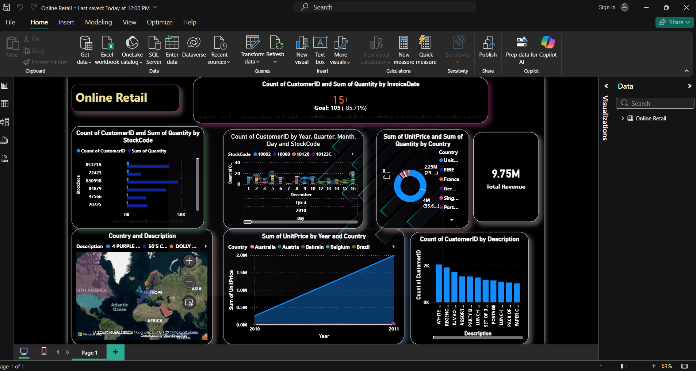

<!-- ================== HEADER ================== -->
<h1 align="center">
  🛍️ Power BI Retail Sales Dashboard
</h1>

<h3 align="center">
  📊 Data Analytics | 📈 Business Insights | ⚡ Interactive Visualization
</h3>

<p align="center">
  
</p>

---

<!-- ================== 3D BADGES ================== -->
<p align="center">
  
  
  
  
</p>

---

<!-- ================== PREVIEW ================== -->
## 🎥 Dashboard Preview

<p align="center">
  
</p>

---

<!-- ================== ABOUT ================== -->
## 📌 About The Project

This project focuses on analyzing **Retail Sales Data** using **Power BI** to generate meaningful business insights.

💡 The dashboard helps in:
- Understanding sales performance 📈  
- Identifying top products 🏆  
- Analyzing customer trends 👥  
- Monitoring profit and revenue 💰  

---

<!-- ================== FEATURES ================== -->
## ✨ Key Features

🚀 Interactive Dashboard  
📊 Sales Trend Analysis  
📍 Region-wise Performance  
🏷️ Category & Product Insights  
📅 Time-based Filtering  
💡 Profit & Revenue Insights  

---

<!-- ================== TECH STACK ================== -->
## 🛠️ Tech Stack

| Tool        | Usage |
|------------|------|
| Power BI   | Data Visualization |
| Excel/CSV  | Data Source |
| DAX        | Calculations |
| Power Query | Data Cleaning |

---

<!-- ================== DATA INSIGHTS ================== -->
## 📊 Insights Generated

✔️ Top selling products identified  
✔️ Most profitable regions analyzed  
✔️ Monthly sales trends visualized  
✔️ Customer purchase patterns studied  

---

<!-- ================== PROJECT STRUCTURE ================== -->
## 📂 Project Structure
PowerBi_retail_sales/
│
├── dataset/
│ └── retail_data.csv
│
├── dashboard/
│ └── retail_dashboard.pbix
│
└── README.md

---

<!-- ================== INSTALL ================== -->
## ⚡ How to Use

1️⃣ Download the `.pbix` file  
2️⃣ Open in **Power BI Desktop**  
3️⃣ Explore dashboard visuals  
4️⃣ Apply filters for insights  

---

<!-- ================== 3D CONTRIBUTION ================== -->
## 🤝 Contribution

Feel free to fork this repo and enhance the dashboard!

```bash
git clone https://github.com/AbhiramSakha/PowerBi_retail_sales.git
 
